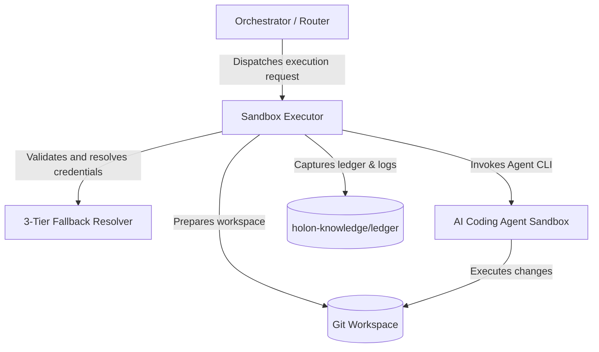
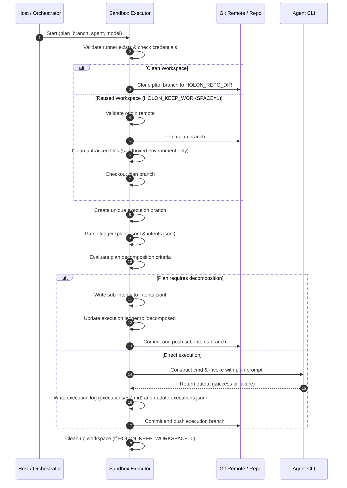

# Execution Architecture Specification

The **Sandbox Executor** is a critical component in the Holon Agentic Coder ecosystem. It is responsible for checking out a plan branch, preparing the sandbox environment, invoking the target AI coding agent, capturing the execution logs and results, writing records to the execution ledger, and committing and pushing the modifications back to the remote repository.

---

## High-Level Architecture

The Sandbox Executor operates as a bridging layer between the orchestrating system and the containerized coding agent.



- **Orchestrator**: Dispatches intent and execution branches to the sandbox runner.
- **Sandbox Executor**: Runs within the execution sandbox (or on the host in local mode) to manage git state, agent configuration, safety checks, and ledger updates.
- **Sandboxes (Process / Container / VM)**: Provide environment isolation. In containerized environments, the executor runs inside specialized agent container images (e.g., `holon/agent-<agent_id>`).

---

## Execution Lifecycle Flow

The execution process follows a strict sequential lifecycle:



### 1. Runner Validation
The executor verifies that the chosen agent is registered in the runner registry and performs initial credential validation under the **3-Tier Fallback Contract**.

### 2. Workspace Preparation
Depending on the environment configuration:
- **Clean Workspace**: If `HOLON_REPO_DIR` is empty or not configured, a default workspace is initialized (either `~/.holon-sandbox/workspace` in sandbox mode or `~/.holon/repo` locally).
- **Stale Workspace Discarding**: If the workspace already contains a `.git` folder but its remote URL does not match the expected `HOLON_REPO_URL`, the workspace is cleared and cloned anew.
- **Workspace Reuse**: Under `HOLON_KEEP_WORKSPACE=1`, the directory is preserved. A `git fetch` is performed, untracked files are cleaned if inside a sandbox, and a force checkout is executed.

### 3. Execution Branch Creation
A unique, tracking-compatible execution branch is spawned off the plan branch:
```
{plan_branch_prefix}/E-{timestamp}-{sanitized_agent}-{sanitized_model}/_
```

### 4. Ledger & Plan Parsing
The executor parses the local ledger files `holon-knowledge/ledger/plans.jsonl` and `holon-knowledge/ledger/intents.jsonl` to locate active intent configurations.

### 5. Decomposition Evaluation
Before invoking the agent, the executor verifies whether the plan needs to be broken down:
- **Entropy Check**: If the plan's `entropy` exceeds the `entropy_budget` (defaults to `5.0`).
- **Explicit Section Check**: If the plan markdown contains a `## Sub-Intents` or `### Sub-Intents` header, the sub-intents are parsed from the bullet list.
- If decomposition is triggered:
  - New sub-intents are appended to `intents.jsonl`.
  - An execution record with state `decomposed` is written to `executions.jsonl`.
  - The branch is committed and pushed, skipping direct agent code execution.

### 6. Agent Invocation
A prompt payload file and an intent JSON file are generated in `/tmp`. The agent's CLI wrapper is executed, forwarding the full prompt. The executor intercepts the exit code to determine the outcome.

### 7. Result Recording & Ledger Updates
An execution log is generated under `executions/E-{id}.md` containing execution metadata, status, and summaries. A matching JSON line is appended to `holon-knowledge/ledger/executions.jsonl`.

### 8. Git Commit & Push
All modified files, ledgers, and logs are added, committed, and pushed back to the origin repository under the unique execution branch (unless `HOLON_SKIP_PUSH=1` is specified).

---

## Safety & Security Policies

### Path-Traversal Protection (`_check_forbidden_root`)

To prevent the sandbox executor from accidentally or maliciously deleting or writing to critical host or container paths (like `/`, `/usr`, etc.) during cleanup operations, a strict path-traversal safelist is enforced.

- **Operation Check**: Any cleanup operation targeting a directory (such as workspace clearing) must pass the `_check_forbidden_root` validation.
- **Allowed Parent Directories (`ALLOWED_PARENTS`)**:
  - `/home`
  - `/Users`
  - `/tmp`
  - `/var/tmp`
  - `/private/var/folders`
  - `/var/folders`
  - `~/.holon-sandbox`
  - `~/.holon`
  - The system-level temporary directory (`tempfile.gettempdir()`)
- **Allowed Exact Paths (`ALLOWED_EXACT`)**:
  - `/workspace`
  - `/repo`
- **Validation Logic**:
  1. The target path is fully resolved to absolute and real (canonicalized) paths via `os.path.abspath` and `os.path.realpath`.
  2. If the path resolves exactly to the system root `/`, execution is aborted with a `RuntimeError`.
  3. The path must either match an item in the allowed exact paths or reside strictly nested within one of the allowed parent paths (evaluated with a trailing slash check to prevent partial name matches, e.g., `/tmp-unsafe` matching `/tmp`).

### Secret Redaction Mechanism

To keep passwords, OAuth tokens, and API credentials from leaking into stdout, stderr, execution ledgers, or printed git outputs:

- **Regex Redaction (`redact_text`)**:
  Interprets strings and dynamically masks:
  - HTTP basic authentication credentials inside URLs (`https://token@github.com...`).
  - Sensitive URL parameters (e.g. `?token=...`, `?api_key=...`, `?code=...`).
  - Common configuration variables matching keys like `token`, `secret`, `password`, `api_key`, `auth`, `bearer`, `pat`, `private_key` paired with separators `:` or `=`.
- **Command Line Argument Masking (`redact_args`)**:
  - Arguments immediately following known secret flags are redacted.
  - **Secret Flags**: `--password`, `--passwd`, `--auth`, or any flag ending in `-token`, `_token`, `-secret`, `_secret`, `-key`, or `_key`.
  - *Limitation*: To avoid over-masking legitimate flags that immediately follow a secret flag, if the secret value itself starts with `-` (resembling a CLI flag), it will **not** be masked.
- **ReDoS Prevention**: Inputs to `redact_text` exceeding 100,000 characters are safely truncated from the middle before regex evaluation.

### Workspace Retention Policy

Workspace state retention is controlled by the environment variable `HOLON_KEEP_WORKSPACE`:

| Environment Variable | Context | Git Cleaning Behavior | Workspace Preservation |
| :--- | :--- | :--- | :--- |
| `HOLON_KEEP_WORKSPACE=0` (or unset) | Any | Cleaned on startup & teardown | Workspace directory is completely deleted |
| `HOLON_KEEP_WORKSPACE=1` | Sandbox (`HOLON_IN_SANDBOX=1`) | Runs `git clean -fd` | Directory preserved, untracked files deleted |
| `HOLON_KEEP_WORKSPACE=1` | Local host / Non-sandbox | Skips `git clean -fd` | Directory preserved, untracked files kept |

> [!NOTE]
> Skipping `git clean -fd` in local host environments allows developers to keep custom `.env` or configuration files in their working directories between test executions.
