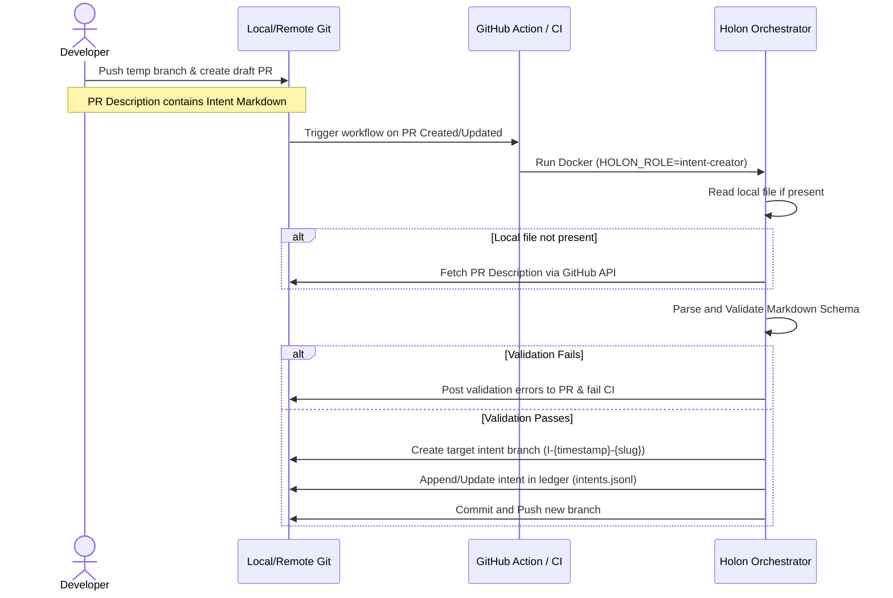

# Design Spec: Markdown-Based Intent Workflow

This document specifies the design for transitioning Holon's intent-definition input from JSON to Markdown (supporting
YAML frontmatter and standard PR templates) and integrating it directly into a Pull Request GitOps workflow.

---

## 1. Workflow Architecture



---

## 2. Intent Markdown Schema

Every intent Markdown file (or PR description) must comply with the following format:

### Option A: YAML Frontmatter (Recommended)

````markdown
---
slug: refactor-metrics
description: Clean up metrics estimators and configuration structure
branch: I-1771890389-refactor-metrics # (optional)
---

# Goal

Refactor local metrics calculations to reduce entropy.

Here is the exact nested structure we want:

```json
{
  "port": 8080,
  "debug": true
}
```
````

````

### Option B: Markdown List
```markdown
- **Slug**: refactor-metrics
- **Description**: Clean up metrics estimators and configuration structure
- **Branch**: I-1771890389-refactor-metrics # (optional)

## Goal
Refactor local metrics calculations to reduce entropy.
````

### Schema Rules

1. **YAML Frontmatter (Option A)**:
   - Checked against a JSON Schema enforcing:
     - `slug`: Required if `branch` is omitted. Must be alphanumeric and hyphenated (`^[a-z0-9-]+$`).
     - `description`: Optional string.
     - `branch`: Optional string.
2. **Markdown Body (Goal)**:
   - The text under the `# Goal` or `## Goal` header is extracted as the intent's `goal` field.
   - Must contain at least one non-empty line of content.

---

## 3. Retrieval & Fallback Logic

To keep both local development and remote CI workflows functional, the orchestrator retrieves the intent data using a
layered priority:

1. **Local Markdown file**: Checks if `/tmp/intent.md` is mounted.
2. **Local JSON file**: Checks if `/tmp/intent.json` is mounted (for backward compatibility).
3. **PR Description**: If no local files exist, fetches the PR description using the GitHub API:
   - **Required variables**: `GITHUB_TOKEN`, `GITHUB_REPOSITORY` (e.g. `owner/repo`), and `GITHUB_PR_NUMBER` or the
     source branch name.
   - **API call**: `GET /repos/{owner}/{repo}/pulls/{pull_number}` to retrieve the `body` field.

---

## 4. Ledger Synchronization & Re-runs

When a PR description is updated, the orchestrator triggers again. Since the intent branch may already exist, the
synchronization logic behaves as follows:

- **Checking Existing Branch**: The orchestrator checks if a remote branch matches the target `branch` or
  `I-{timestamp}-{slug}`.
- **Ledger Overwrite (Not Append)**: If the branch already exists, the orchestrator updates/replaces the existing JSON
  entry matching `branch` in `holon-knowledge/ledger/intents.jsonl` rather than appending a duplicate entry.
- **Commit/Push**: The orchestrator commits the updated ledger on the target branch and performs a standard push.

---

## 5. CI Status & PR Feedback

If the PR description fails validation, the CI check should fail. Feedback must be reported directly in the PR context:

- **No Side Effects**: If validation fails, no branch is created, and the ledger is not modified.
- **Linter Warnings**: A GitHub API comment is posted on the PR showing exactly what validation rule failed. For
  example:
  > ❌ **Intent Validation Failed**
  >
  > - `slug` field is missing or contains invalid characters (must be lowercase and hyphenated).
  > - Missing `# Goal` or `## Goal` section in PR description.
