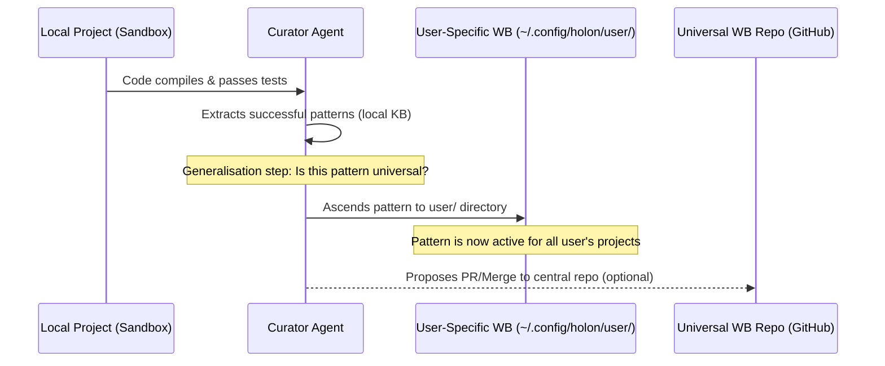

# Knowledge Sharing and Synchronisation

This document describes how the Holon system resolves, partitions, and synchronises knowledge across three distinct
levels: project-specific knowledge, user-specific knowledge, and universal knowledge.

To prevent git conflicts and file collisions, these knowledge levels are isolated into separate namespaces.

---

## The Knowledge Hierarchy

When an agent needs to retrieve guidelines, patterns, or methodologies during planning or execution, it queries the
following directories in order from most specific to most generic:

```
┌──────────────────────────────────────────────────────────┐
│ 1. Local Project KB (`my-app/holon-knowledge/kb/`)       │
│    - Specific to this codebase/repository only.          │
│    - Database schemas, internal APIs, custom patterns.   │
└──────────────────────────┬───────────────────────────────┘
                           │ Fallback
┌──────────────────────────▼───────────────────────────────┐
│ 2. User-Specific WB (`~/.config/holon/user/`)            │
│    - Shared across all local projects for this developer.│
│    - Personal rules, customised scripting shortcuts.     │
└──────────────────────────┬───────────────────────────────┘
                           │ Fallback
┌──────────────────────────▼───────────────────────────────┐
│ 3. Universal WB (`~/.config/holon/universal/`)           │
│    - Global engineering rules (e.g. Red-Green testing).  │
│    - Cloned from a central public or organisation repo.  │
└──────────────────────────────────────────────────────────┘
```

---

## Global Directory Structure (`~/.config/holon/`)

To avoid collision between user-specific additions and updates to the universal knowledge base, `~/.config/holon/` is
explicitly segmented into namespaces:

```
~/.config/holon/
├── universal/                  <-- Cloned Universal Repository (Managed by Git)
│   ├── .git/
│   ├── general/
│   │   └── red_green_refactor.md
│   └── git_flow/
│       └── branching_disciplines.md
│
└── user/                       <-- User-Specific Knowledge (Local Only)
    └── python/
        └── custom_debugging_tricks.md
```

---

## Synchronization Lifecycle

### 1. Bootstrapping

When the Holon CLI is first run on a developer machine:

- The directory `~/.config/holon/` is created.
- The universal repository is cloned into the `universal/` subdirectory:
  ```bash
  git clone https://github.com/Holon-Agentic-Coder/holon-universal-knowledge.git ~/.config/holon/universal
  ```
- An empty directory structure is initialised under `user/` to act as the destination for the user's custom heuristics.

### 2. Updating Universal Knowledge

The universal knowledge base is updated periodically or manually via the CLI:

- **Automatic updates:** The engine performs a shallow pull in the background during engine startup.
- **Manual updates:** The user runs the sync command:
  ```bash
  holon sync
  ```
  This executes a pull inside the target directory:
  ```bash
  cd ~/.config/holon/universal && git pull
  ```
  Because the user's personal knowledge lives in the sibling directory `user/`, it remains completely safe from git
  overrides or merge conflicts.

---

## The Ascension Pipeline

Local learnings are promoted up the hierarchy through the **Ascension Pipeline** managed by the **Curator Agent**:



1. **Extraction:** During project execution, successful implementations are logged. The Curator Agent identifies
   reusable patterns and saves them to the project's local KB at `./holon-knowledge/kb/`.
2. **User Ascension:** If the Curator notes that a pattern is generalised (e.g., standard Python type-hints or clean JS
   async calls), it copies/ascends it to the global directory `~/.config/holon/user/`.
3. **Community Contribution (Optional):** To share this rule with the wider community or team, a pull request can be
   opened from the user's local additions to the main central `holon-universal-knowledge` repository.
